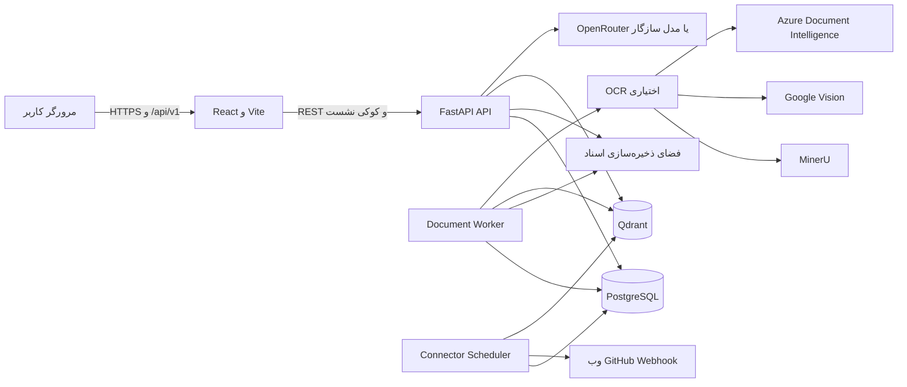
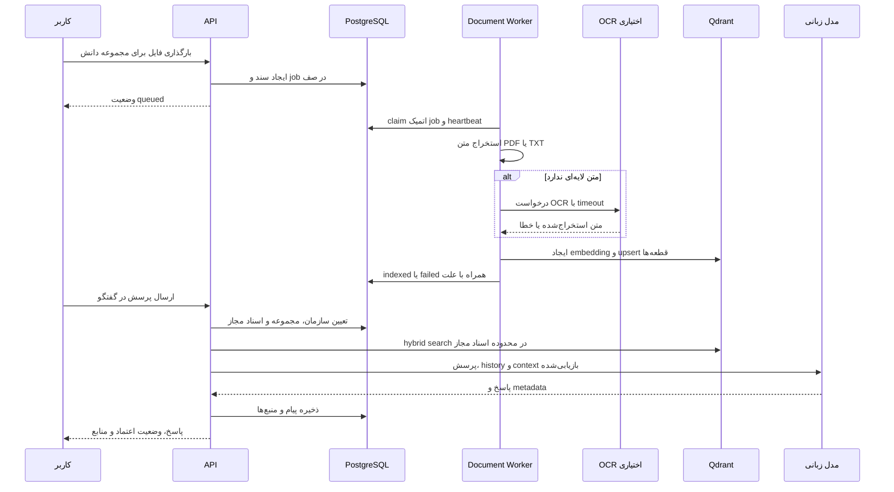

# معماری Nexora

این سند اجزای اصلی Nexora، مرز داده‌ها و مسیرهای اصلی پردازش را توضیح می‌دهد. جزئیات نیازمندی‌های محصول در [SRS](documents/SRS-Nexora.docx) و قواعد رابط در [DESIGN.md](DESIGN.md) قرار دارند.

## نمای کلان

رابط وب روی `localhost:5173` در توسعه اجرا می‌شود و Vite درخواست‌های `/api` را به API روی پورت `8000` پروکسی می‌کند. API، Worker و Scheduler فرایندهای مستقل هستند، اما باید به PostgreSQL، Qdrant و فضای ذخیره‌سازی مشترک متصل باشند.

## اجزا

| جزء | مسئولیت | محل اصلی |
| --- | --- | --- |
| رابط وب | احراز هویت، مدیریت مجموعه و اسناد، گفتگو، Assistant، تحلیل و نمایش وضعیت عملیات | `frontend/my-rag-app/src` |
| API | API نسخه‌بندی‌شده، کنترل دسترسی، پردازش درخواست‌ها، readiness و rate limit | `backend/app/main.py` و `backend/app/api/routes` |
| PostgreSQL | داده‌های سازمان، کاربر، نشست، سند، گفتگو، Connector، Worker registry و وضعیت کارها | `backend/app/models` و `backend/app/db` |
| Qdrant | بردارهای قطعه‌های سند و metadata لازم برای بازیابی محدودشده | `backend/app/services/qdrant.py` |
| فضای ذخیره‌سازی | فایل اصلی اسناد و دارایی‌های پردازش‌شده | `DOCUMENT_STORAGE_DIR` یا `backend/storage/documents` |
| Document Worker | دریافت کار پردازش، استخراج، OCR، قطعه‌بندی، embedding و ایندکس | `backend/app/workers/document_worker.py` |
| Connector Scheduler | اجرای همگام‌سازی‌های زمان‌بندی‌شده و کنترل Lease | `backend/app/workers/connector_scheduler_worker.py` |
| ارائه‌دهنده مدل | بازنویسی پرسش، برنامه‌ریزی پژوهش و تولید پاسخ مبتنی بر منبع | `backend/app/services/openrouter.py` |
| OCR اختیاری | خواندن PDF یا تصویر اسکن‌شده با MinerU، Google Vision یا Azure | `backend/app/services/cloud_ocr.py` |

## مرز چندسازمانی و دسترسی

سازمان مرز اصلی داده در Nexora است. کاربر پس از احراز هویت، فقط داده‌های سازمان خود را می‌بیند. routeها و serviceها باید شناسهٔ سازمان کاربر را در خواندن و نوشتن داده اعمال کنند. در مسیر RAG، ابتدا مجموعهٔ دانش و اسناد مجاز تعیین می‌شوند، سپس جست‌وجوی Qdrant فقط با شناسهٔ همان اسناد اجرا می‌شود.

نقش‌ها:

- کاربر عادی: گفتگو، مشاهدهٔ منابع، Assistantها و مجموعه‌های مجاز، اشتراک‌گذاری و بازخورد در محدودهٔ دسترسی.
- مدیر: علاوه بر موارد بالا، مدیریت اعضا، مجموعه‌های دانش، اسناد، Connectorها، Assistantها، تحلیل و ارزیابی.

نشست با کوکی `HttpOnly` نگهداری می‌شود. API نباید صرفاً به پنهان‌کردن گزینه‌های رابط تکیه کند؛ کنترل دسترسی در route و service الزامی است.

## مسیر فایل تا پاسخ

### وضعیت پردازش سند

سند از وضعیت صف به مرحلهٔ خواندن محتوا، OCR در صورت نیاز، قطعه‌بندی و ایندکس حرکت می‌کند. درصد پیشرفت و خطای پردازش در دادهٔ سند نگهداری می‌شود. در خطا، سند نباید `indexed` شود و مدیر می‌تواند Retry را آغاز کند.

Worker کار را با claim و lease از پایگاه داده دریافت می‌کند. heartbeat job در thread جداگانه ادامه دارد تا استخراج طولانی یا ارتباط با Qdrant باعث رهاشدن اشتباه کار نشود. Worker registry نیز heartbeat مستقل دارد و readiness از آن برای تشخیص آماده‌بودن Worker استفاده می‌کند.

## مسیر گفتگو و بازیابی

مسیرهای `conversations`، `rag`، `search` و `research` از سرویس‌های بازیابی و مدل استفاده می‌کنند. ورودی گفتگو شامل مجموعهٔ دانش، سند یا Assistant انتخاب‌شده است. API مجموعهٔ اسناد قابل استفاده را از PostgreSQL به‌دست می‌آورد، سپس Qdrant با فیلتر شناسهٔ سندها جست‌وجو می‌شود.

پاسخ همراه یکی از وضعیت‌های زیر در رابط نشان داده می‌شود:

- پاسخ مستند: منبع مرتبط در مجموعهٔ دانش وجود دارد.
- پاسخ ترکیبی: منبع و دانش عمومی مدل در پاسخ اثر داشته‌اند.
- پشتوانهٔ ناکافی: منبع مرتبط یا پوشش کافی پیدا نشده است.

نام فایل، قطعه یا صفحهٔ منبع در پاسخ نگهداری می‌شود تا کاربر بتواند دلیل پاسخ را بررسی کند. گفتگوی ذخیره‌شده شامل پیام‌ها، پاسخ‌ها و metadata منبع است.

## OCR و دادهٔ خارجی

OCR پیش‌فرض غیرفعال است. وقتی سند متن لایه‌ای ندارد، `cloud_ocr.py` تنها در صورت پیکربندی یک ارائه‌دهنده فعال می‌شود.

| حالت `OCR_PROVIDER` | رفتار |
| --- | --- |
| `disabled` | OCR انجام نمی‌شود؛ سند اسکن‌شده با پیام قابل اقدام ناموفق می‌شود. |
| `mineru` | فقط MinerU در صورت وجود `MINERU_API_TOKEN` استفاده می‌شود. |
| `google_vision` | فقط Google Vision در صورت وجود کلید استفاده می‌شود. |
| `azure_document_intelligence` | فقط Azure در صورت وجود endpoint و کلید استفاده می‌شود. |
| `auto` | MinerU، سپس Google Vision و Azure فقط در صورت پیکربندی امتحان می‌شوند. |

OCR یک مرز داده‌ای است: فایل یا تصویر ممکن است به سرویس بیرونی ارسال شود. کلیدها نباید در مخزن، پاسخ API یا log باشند و فعال‌سازی ارائه‌دهنده باید با سیاست محرمانگی سازمان سازگار باشد.

## Connector و همگام‌سازی

Connector به یک مجموعهٔ دانش متصل است و می‌تواند منبع وب، GitHub یا Webhook باشد. Scheduler Connectorهای موعددار را پیدا می‌کند و پیش از sync یک Lease با تصاحب اتمیک در جدول `sync_leases` می‌گیرد. heartbeat lease هنگام عملیات شبکه‌ای طولانی ادامه دارد. اگر فرایند متوقف شود، lease پس از انقضا قابل تصاحب مجدد است.

Connectorها نباید راز خود را در API یا رابط نمایش دهند. دریافت راز Connector از Secret Manager سازمانی انجام می‌شود؛ متغیر محیطی حجیم حاوی راز همهٔ سازمان‌ها برای محیط Production مناسب نیست.

## سلامت، readiness و مشاهده‌پذیری

- `GET /health` فقط liveness فرایند را برمی‌گرداند و نباید collection، index یا فایل موقت ایجاد و حذف کند.
- `GET /ready` اتصال PostgreSQL، دسترسی نوشتن به فضای ذخیره‌سازی، Qdrant و وجود heartbeat تازه برای `document_worker` و `connector_scheduler` را بررسی می‌کند.
- در صورت شکست وابستگی حیاتی، `/ready` با `503` پاسخ می‌دهد.
- خطاهای وابستگی خارجی، پردازش سند و همگام‌سازی باید بدون افشای راز ثبت شوند.

## استقرار و مقیاس‌پذیری

API به‌صورت افقی قابل تکثیر است. بیش از یک Document Worker نیز می‌تواند اجرا شود، زیرا jobها با claim پایگاه داده تصاحب می‌شوند. Scheduler معمولاً یک نمونه دارد؛ Lease مانع اجرای هم‌زمان یک همگام‌سازی واحد می‌شود.

همهٔ replicaها باید از فضای ذخیره‌سازی مشترک یا سرویس ذخیره‌سازی سازگار استفاده کنند. نگهداری مسیر مطلق محلی در دادهٔ سند قابل اتکا نیست؛ برنامه مسیرها را نسبت به `DOCUMENT_STORAGE_DIR` ذخیره می‌کند.

## مرجع‌های کد

| موضوع | مرجع |
| --- | --- |
| پیکربندی | `backend/app/core/config.py` |
| routeها و health | `backend/app/main.py` و `backend/app/api/routes` |
| صف و پردازش سند | `backend/app/services/document_jobs.py` |
| بازیابی | `backend/app/services/retrieval.py` |
| OCR | `backend/app/services/cloud_ocr.py` |
| قفل Connector | `backend/app/services/connector_lock.py` |
| heartbeat Worker | `backend/app/services/worker_heartbeat.py` |
| قرارداد طراحی رابط | `DESIGN.md` |
