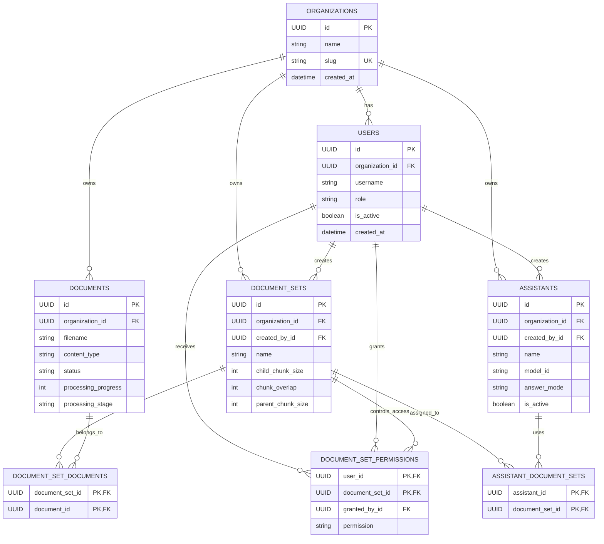
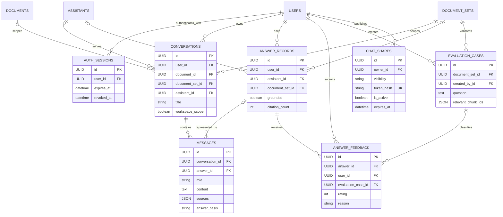
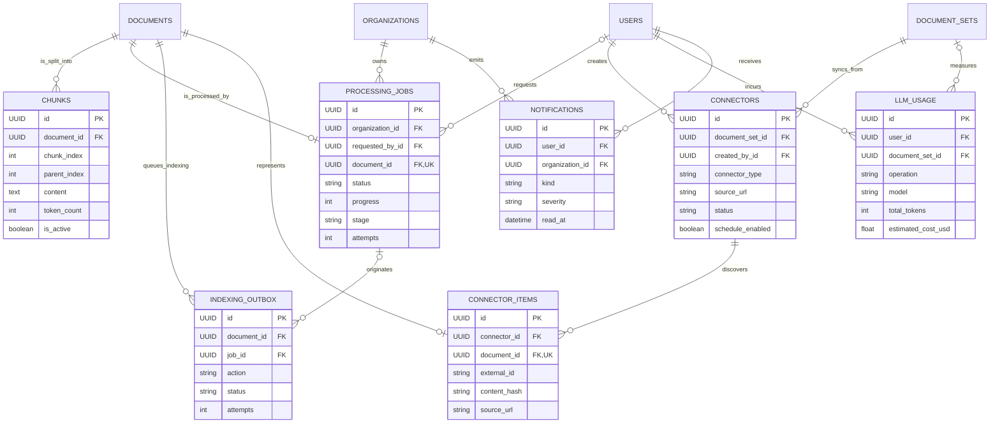

# نمودار موجودیت و رابطهٔ Nexora

این نمودار بر اساس مدل‌های پایگاه‌دادهٔ بک‌اند در `backend/app/models` تهیه شده است. هر نمودار بخشی از یک پایگاه‌دادهٔ PostgreSQL واحد را نشان می‌دهد. جدول‌های واسط، رابطه‌های چندبه‌چند را به‌صورت صریح نگه می‌دارند.

## راهنمای روابط

در نمودارهای Mermaid، `||` یعنی «دقیقاً یک»، `o|` یعنی «صفر یا یک»، `o{` یعنی «صفر تا چند» و `|{` یعنی «یک تا چند». برای نمونه، `ORGANIZATIONS ||--o{ USERS` یعنی هر کاربر دقیقاً به یک سازمان تعلق دارد و هر سازمان می‌تواند صفر یا چند کاربر داشته باشد.

| نوع رابطه | موجودیت‌ها | پیاده‌سازی در پایگاه‌داده |
| --- | --- | --- |
| یک‌به‌چند | Organization → User، DocumentSet، Document، Assistant و ProcessingJob | کلید خارجی `organization_id` در موجودیت فرزند |
| یک‌به‌چند | Document → Chunk | کلید خارجی `chunks.document_id` |
| یک‌به‌چند | Conversation → Message | کلید خارجی `messages.conversation_id` |
| یک‌به‌چند | AnswerRecord → AnswerFeedback | کلید خارجی `answer_feedback.answer_id` |
| یک‌به‌چند | DocumentSet → Connector | کلید خارجی `connectors.document_set_id` |
| یک‌به‌چند | Connector → ConnectorItem | کلید خارجی `connector_items.connector_id` |
| یک‌به‌چند | User → AuthSession، Notification، ChatShare و LLMUsage | کلید خارجی کاربر در جدول فرزند |
| یک‌به‌یک اختیاری | Document ↔ ProcessingJob | `processing_jobs.document_id` هم کلید خارجی و هم یکتا است؛ یک سند حداکثر یک کار پردازش فعال دارد |
| یک‌به‌یک اختیاری | Document ↔ ConnectorItem | `connector_items.document_id` یکتا است؛ سندِ حاصل از Connector حداکثر یک نمایندهٔ Connector دارد |
| چندبه‌چند | DocumentSet ↔ Document | جدول واسط `document_set_documents` با کلید مرکب |
| چندبه‌چند | Assistant ↔ DocumentSet | جدول واسط `assistant_document_sets` با کلید مرکب |
| چندبه‌چند با ویژگی رابطه | User ↔ DocumentSet | جدول واسط `document_set_permissions`؛ سطح دسترسی و اعطاکننده را نگه می‌دارد |

رابطه‌های `Conversation → Document`، `Conversation → DocumentSet` و `Conversation → Assistant` اختیاری‌اند؛ هر گفتگو بسته به scope خود می‌تواند به یک سند، یک مجموعهٔ دانش، یک دستیار یا فضای کاری متصل باشد. همین وضعیت برای `AnswerRecord → Assistant` و `AnswerRecord → DocumentSet` نیز برقرار است.

## سازمان، کاربران و دانش

## گفتگو، پاسخ و بازخورد

## پردازش اسناد، همگام‌سازی و عملیات

`messages.sources`، `chat_shares.messages`، برچسب‌ها و داده‌های تحلیلی به‌صورت JSON نگه‌داری می‌شوند و در مدل فعلی جدول رابطه‌ای جداگانه ندارند. بردارهای بازیابی‌شده نیز در Qdrant ذخیره می‌شوند؛ بنابراین در این ERD که مدل رابطه‌ای PostgreSQL را توصیف می‌کند، نمایش داده نشده‌اند.
