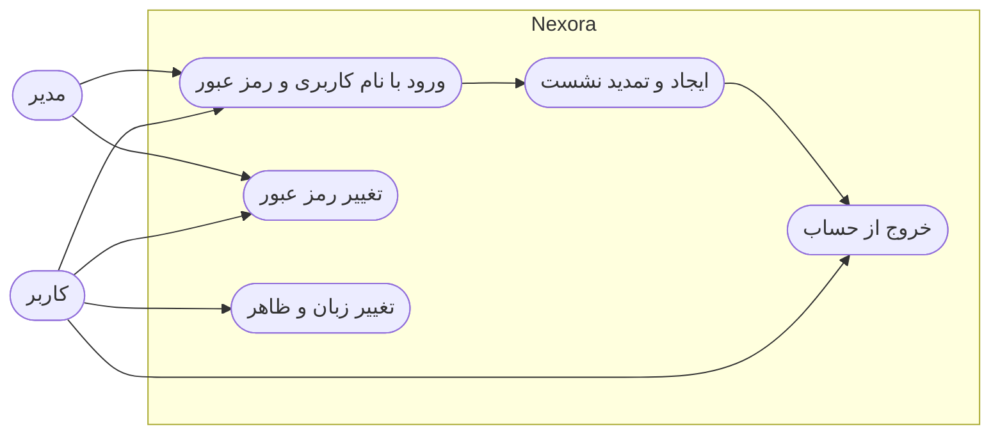
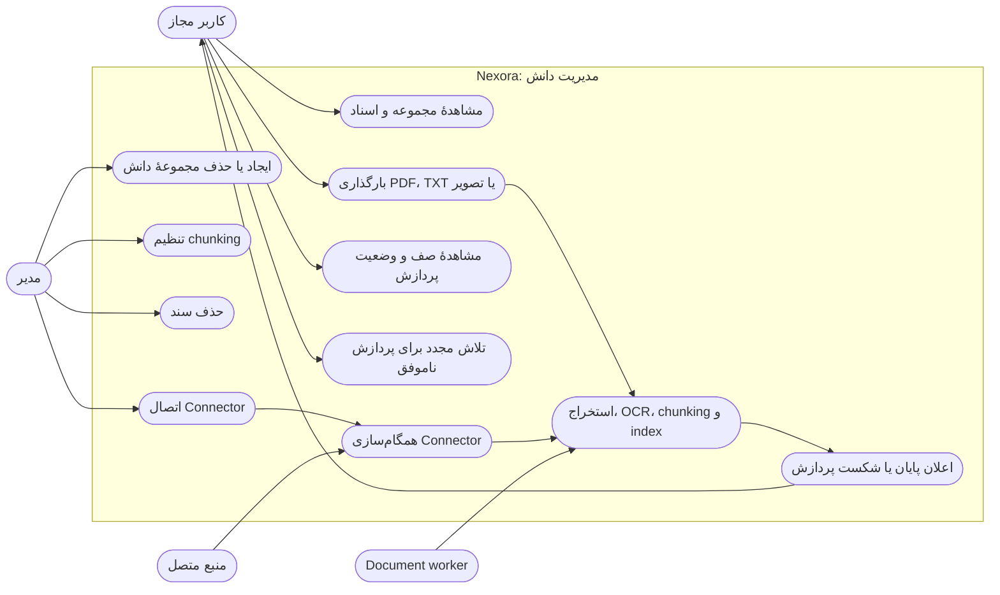
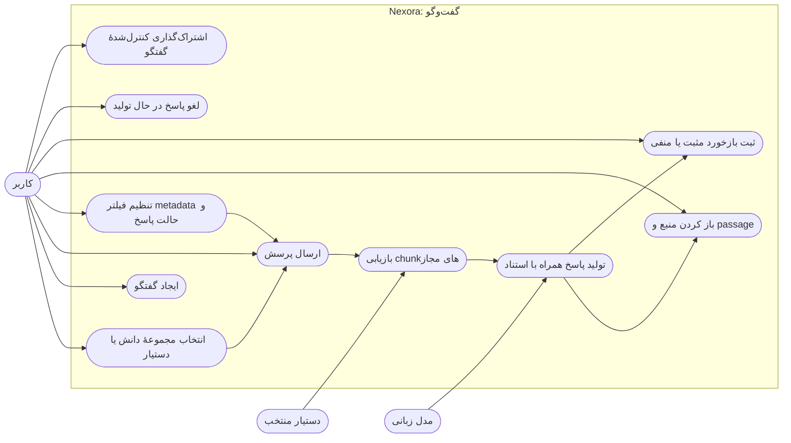
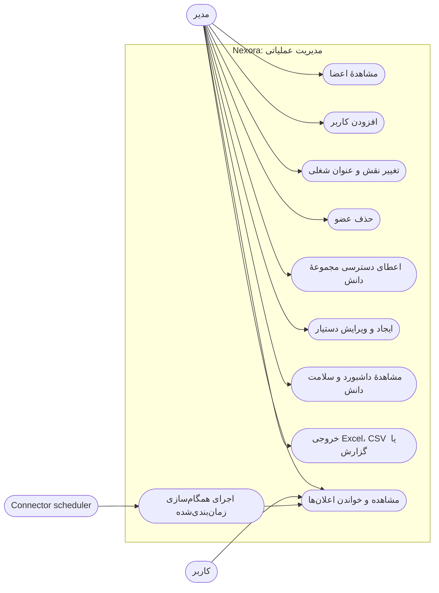
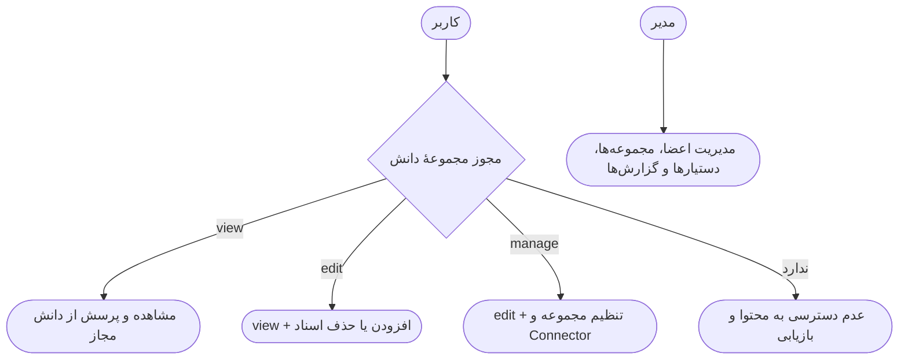

# نمودارهای Use Case Nexora

این نمودارها تعامل نقش‌های اصلی با قابلیت‌های فعلی Nexora را نشان می‌دهند. «کاربر» به عضوی با نقش `user` و «مدیر» به عضوی با نقش `admin` اشاره دارد. مدیر همهٔ قابلیت‌های کاربر را نیز در اختیار دارد، مگر آن‌که سطح دسترسی مجموعهٔ دانش محدود شده باشد.

## ورود و مدیریت نشست

## مجموعه‌های دانش و اسناد

## گفت‌وگوی مبتنی بر منبع

## مدیریت تیم، دسترسی و عملیات

## مرزهای مجوز

جریان پردازش سند و همگام‌سازی ممکن است خارج از جلسهٔ کاربر اجرا شود، اما نتیجهٔ آن از طریق وضعیت اسناد و اعلان‌های داخل محصول به کاربر بازتاب داده می‌شود.
