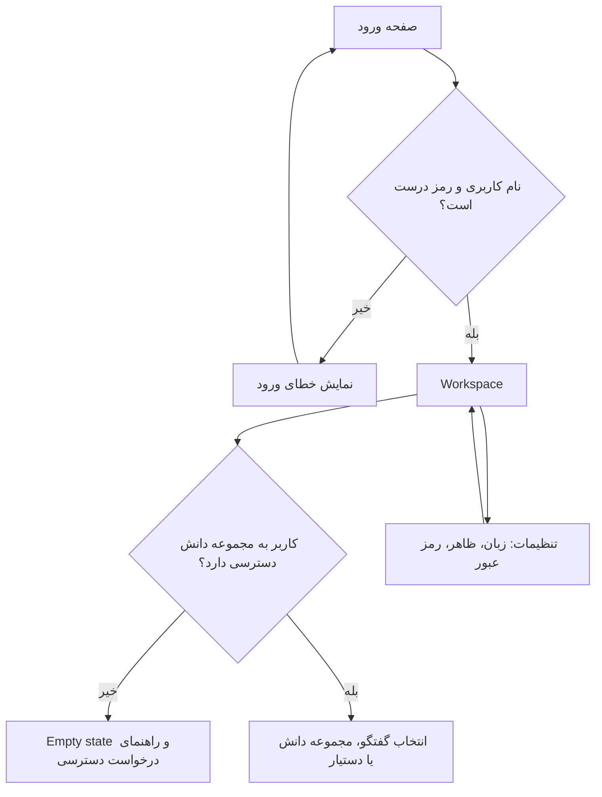
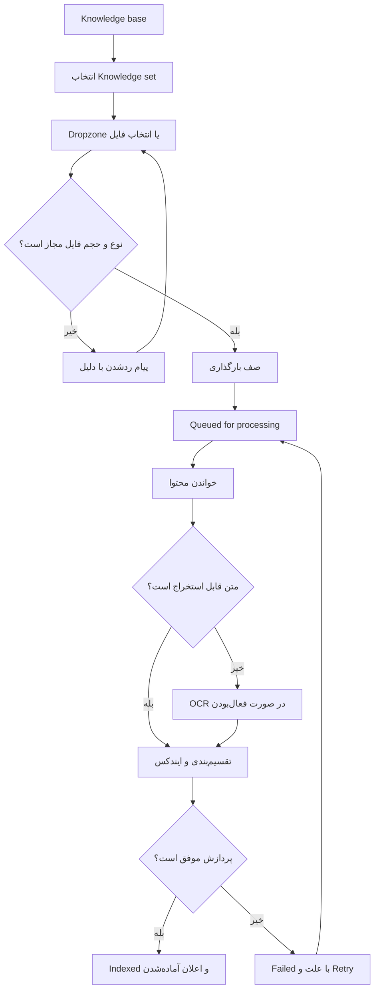
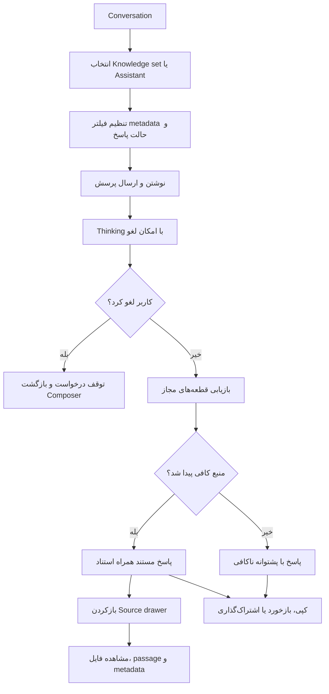
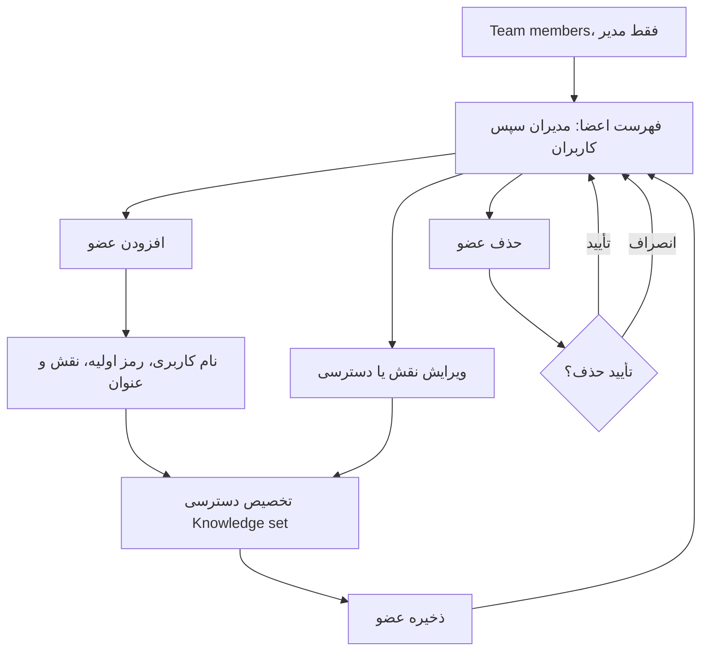
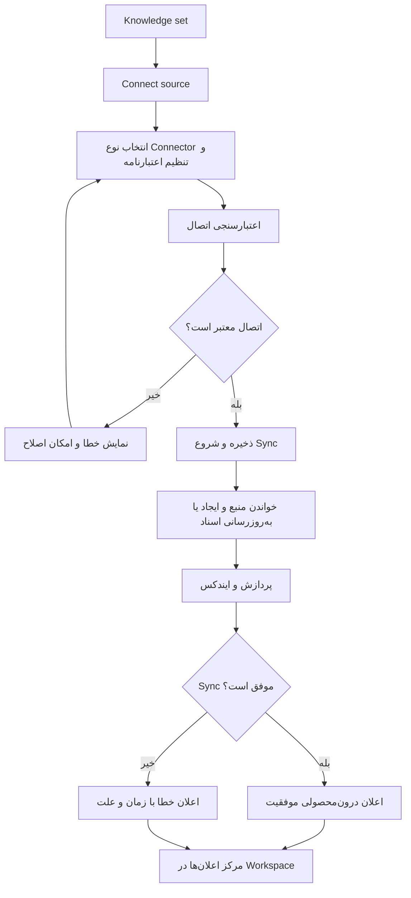

# جریان‌های اصلی Nexora

این Wireflowها مسیرهای اصلی محصول را پیش از طراحی Wireframe مشخص می‌کنند. هر گره نمایانگر یک صفحه، پنل، دیالوگ یا تصمیم قابل مشاهده برای کاربر است.

## ۱. ورود و شروع کار

## ۲. بارگذاری و آماده‌سازی سند

## ۳. گفت‌وگوی مبتنی بر منبع

## ۴. مدیریت تیم و سطح دسترسی

## ۵. Connector و اعلان وضعیت

## ترتیب ساخت Wireframe

۱. Login و Workspace؛ ۲. Conversation و Source drawer؛ ۳. Knowledge base و جریان بارگذاری؛ ۴. Assistants؛ ۵. Team members؛ ۶. Settings؛ ۷. نسخه‌های موبایل Conversation و Knowledge base.

Wireframeها باید هر مسیر را با حالت‌های عادی، خالی، درحال‌پردازش و خطا پوشش دهند. برای جزئیات رفتاری و سطح دسترسی، `documents/USE_CASES.md` و `DESIGN.md` مرجع هستند.
